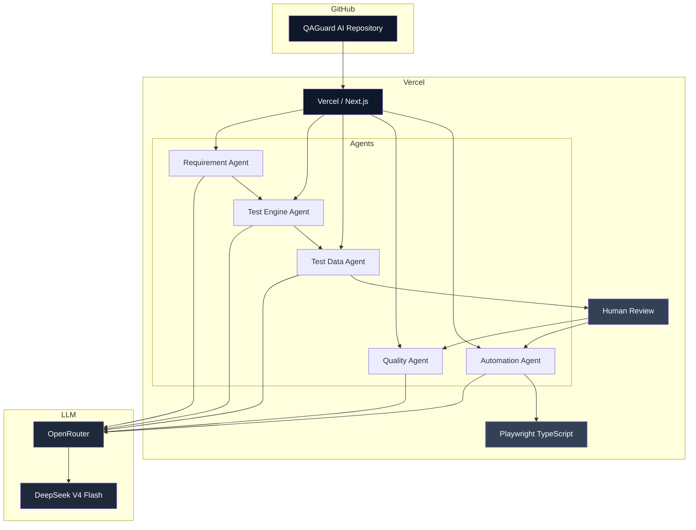
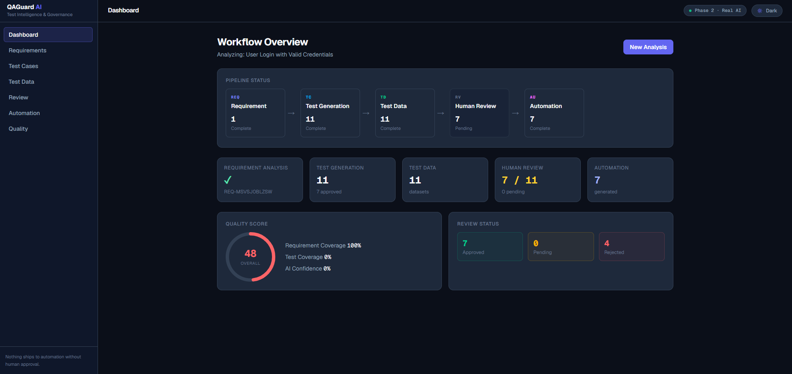
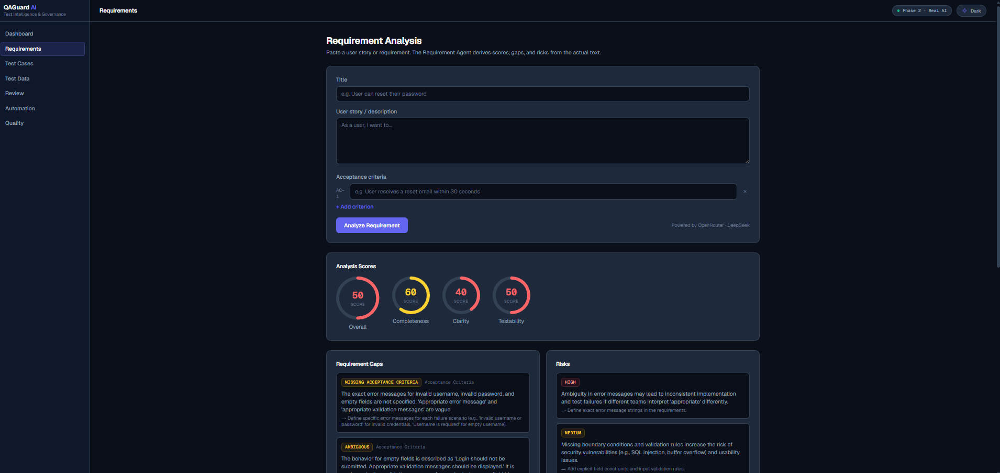
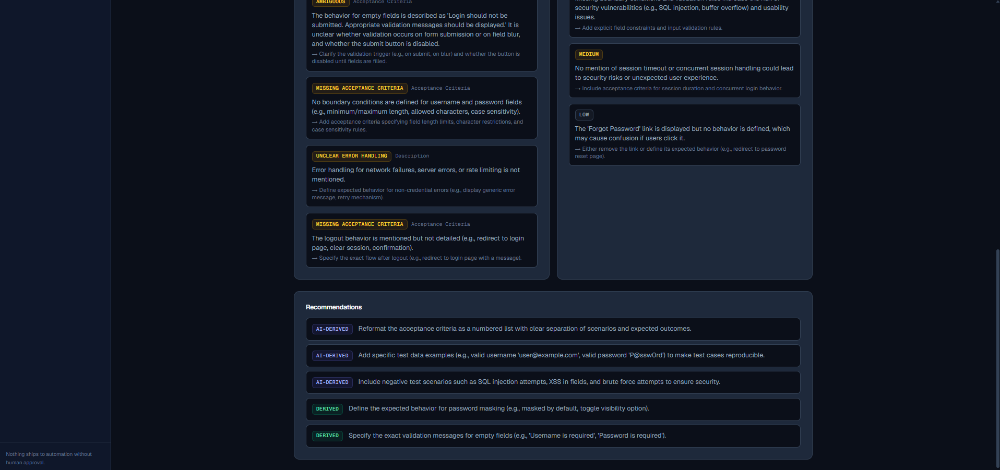
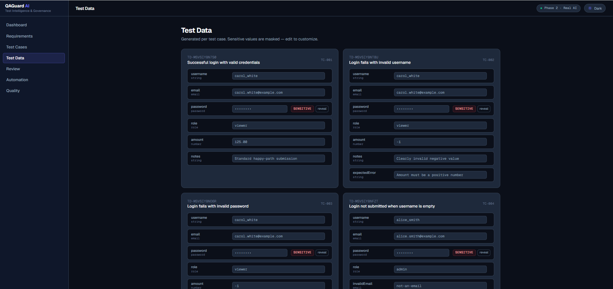
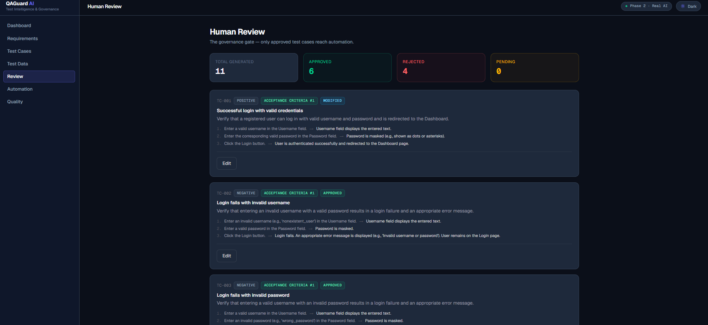
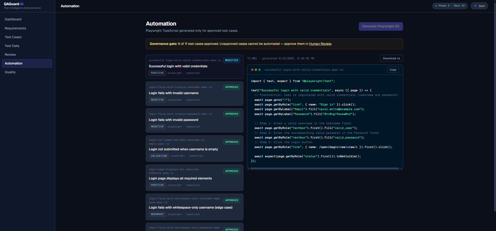
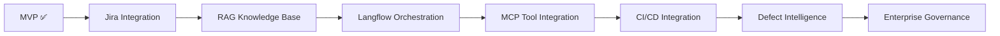

# 🛡️ QAGuard AI

**AI-Powered Test Intelligence & Governance**

> Transform software requirements into governed, traceable, reviewable, and automatable testing artifacts — with a human approving every step before anything ships to automation.

---

## 📖 Table of Contents

- [Problem Statement](#problem-statement)
- [Solution](#solution)
- [Currently Implemented](#currently-implemented)
- [AI Agent Architecture](#ai-agent-architecture)
- [Governance Model](#governance-model)
- [Tech Stack](#tech-stack)
- [Architecture](#architecture)
- [Demo](#demo)
- [Screenshots](#screenshots)
- [How to Run Locally](#how-to-run-locally)
- [Why QAGuard AI?](#why-qaguard-ai)
- [🚀 Future Roadmap](#-future-roadmap)
- [Security](#security)
- [Limitations](#limitations)
- [Project Status](#project-status)

---

## Problem Statement

QA teams face a fragmented, manual pipeline that is slow, inconsistent, and hard to govern:

- **Manual requirement analysis** — every story is interpreted differently by every engineer
- **Missing test scenarios** — edge cases, negative paths, and boundaries get overlooked
- **Inconsistent test coverage** — no repeatable standard for what "good" looks like
- **AI hallucination** — raw LLM output invents business rules, UI, and behavior that were never specified
- **Test data creation effort** — realistic, safe test data is time-consuming to produce
- **Lack of traceability** — nobody can prove which test verifies which requirement
- **Automating unreviewed AI output** — unapproved AI-generated tests end up in CI, untrusted
- **Difficulty measuring test quality** — no objective signal of coverage, risk, or confidence

Simply generating test cases with an LLM is not enough. Without grounding, validation, traceability, human approval, and quality measurement, AI output is just more untrusted text.

## Solution

QAGuard AI enforces a governed pipeline where **AI generates, humans review, and governance controls automation**:

```
Requirement
    ↓
AI Requirement Analysis
    ↓
AI Test Generation
    ↓
AI Test Data
    ↓
Human Review
    ↓
AI Quality Assessment
    ↓
Approved Tests
    ↓
Playwright Automation
    ↓
Quality + Traceability Dashboard
```

**Core principle:** Nothing ships to automation without a human approving it.

---

## Currently Implemented

Everything below is **implemented and working** in the current codebase:

| Feature | Status |
|---|---|
| **Requirement Agent** — real LLM analysis (scores, gaps, risks, recommendations) | ✅ Implemented |
| **Test Engine Agent** — real LLM test case generation (positive/negative/boundary/validation/security/regression) | ✅ Implemented |
| **Test Data Agent** — real LLM synthetic test data, traceable to test cases | ✅ Implemented |
| **Quality Agent** — real LLM quality assessment with findings & recommendations | ✅ Implemented |
| **Automation Agent** — real LLM Playwright TypeScript generation, approved-tests only | ✅ Implemented |
| **OpenRouter integration** — server-side, structured JSON output | ✅ Implemented |
| **DeepSeek V4 Flash** — configured LLM model | ✅ Implemented |
| **Contract validation** — every LLM response validated field-by-field before reaching the UI | ✅ Implemented |
| **Hallucination / grounding controls** — strict prompts, no invented business rules | ✅ Implemented |
| **Test data security validation** — credential-like values rejected | ✅ Implemented |
| **Human approval workflow** — approve / reject / edit test cases | ✅ Implemented |
| **Traceability** — requirement → test case → test data → automation | ✅ Implemented |
| **Quality scoring** — coverage, risk coverage, traceability, findings | ✅ Implemented |
| **Playwright TypeScript generation** — web-first assertions, locator-based | ✅ Implemented |
| **Server-side API key handling** — key never reaches the browser | ✅ Implemented |
| **Sample story loader** — one-click load of a demo login story | ✅ Implemented |
| **Dark/Light theme** — persisted, no flash, hydration-safe | ✅ Implemented |
| **Vercel deployment** | ✅ Live |
| **GitHub repository** | ✅ Public |

---

## AI Agent Architecture

### Requirement Agent
- Analyzes the supplied requirement for completeness, clarity, and testability
- Identifies gaps and risks grounded only in the requirement text
- Produces a structured, validated `RequirementAnalysis`

### Test Engine Agent
- Generates typed test cases from the requirement + analysis
- Positive / negative / boundary / validation / security / regression coverage (only when applicable)
- Every test case carries requirement traceability (`Acceptance Criteria #N` or `AI-Derived`)

### Test Data Agent
- Generates synthetic test data associated with each test case
- Sensitive values use safe placeholders (`<VALID_PASSWORD>`, `<TOKEN>`)
- Rejects credential-like values before they reach the UI

### Quality Agent
- Evaluates the actual pipeline artifacts (requirement, analysis, test cases, test data, review status)
- Produces coverage scores + findings (severity, category, evidence, recommendation)
- Never invents evidence — every finding is grounded in supplied artifacts

### Automation Agent
- Generates Playwright TypeScript **only for approved test cases**
- Uses the approved test data — never generates new data during automation
- Preserves requirement → test-case → automation traceability

---

## Governance Model

QAGuard AI does **not** automatically trust AI output. Every stage is gated:

```
AI Generation
    ↓
Validation        → strict contracts, schema checks, secret detection
    ↓
Human Review      → approve / reject / edit
    ↓
Quality Gate      → measured coverage, traceability, findings
    ↓
Automation        → only approved test cases
```

Key mechanisms:

- **Strict contracts** — typed `TestCase`, `TestData`, `QualityReport`, `AutomationArtifact`
- **Schema validation** — hand-written validators reject malformed LLM output (never silently repaired)
- **Traceability** — every artifact links back to its requirement and test case
- **Approval status** — automation is blocked (HTTP 403) for unapproved tests
- **Secret detection** — credential-like values rejected in test data and generated code
- **Grounded prompts** — models instructed to use only supplied evidence
- **Safe error handling** — no API keys, URLs, or stack traces reach the user
- **No automatic approval** — AI output is always a draft awaiting human review

---

## Tech Stack

| Layer | Technology |
|---|---|
| **Frontend** | Next.js, React, TypeScript, Tailwind CSS |
| **Backend** | Next.js API Routes, TypeScript |
| **AI** | OpenRouter, DeepSeek V4 Flash (`deepseek/deepseek-v4-flash`) |
| **Testing** | Generated Playwright TypeScript artifacts |
| **State** | React Context (`WorkflowProvider`) + localStorage persistence |
| **Theme** | Custom dark/light tokens + `useSyncExternalStore` |
| **Source control** | Git, GitHub |
| **Deployment** | Vercel |

---

## Architecture



Traceability flows through the pipeline: every requirement id, test case id, and artifact links back to its source.

---

## Demo

- **Live demo:** [https://qaguard-ai.vercel.app](https://qaguard-ai.vercel.app)
- **Source code:** [https://github.com/omgutty/qaguard-ai](https://github.com/omgutty/qaguard-ai)
- **Demo video:** [screenshots/Demo_Video.mp4](screenshots/Demo_Video.mp4)

---

## Screenshots

| Module | Screenshot |
|---|---|
| Dashboard |  |
| Requirement Analysis |  |
| Requirement Recommendations |  |
| Test Cases |  |
| Test Data |  |
| Human Review |  |
| Quality & Traceability Board |  |
| Playwright Automation |  |

---

## How to Run Locally

```bash
git clone https://github.com/omgutty/qaguard-ai.git
cd qaguard-ai
npm install
```

Create `.env.local` from the example:

```bash
cp .env.local.example .env.local
```

Then add your OpenRouter key (never commit this file):

```
OPENROUTER_API_KEY=
OPENROUTER_MODEL=deepseek/deepseek-v4-flash
```

**Important:** the real API key must never appear in the README, source code, or be exposed with a `NEXT_PUBLIC_` prefix. It lives only in server-side environment variables.

Start the app:

```bash
npm run dev
```

Open [http://localhost:3000](http://localhost:3000).

> **Note:** The application requires an OpenRouter API key for real AI functionality. Some local development machines may hit a TLS/CA certificate issue when calling OpenRouter; the production Vercel deployment does not have this problem. Disabling TLS verification is not recommended as a production solution.

Useful scripts:

```bash
npm run lint            # ESLint
npm run build           # Production build + typecheck
npm run verify:ai       # Verify OpenRouter provider config (no API call)
npm run verify:agent    # Verify Requirement Agent (no API call)
npm run verify:engine   # Verify Test Engine Agent (no API call)
npm run verify:test-data# Verify Test Data Agent (no API call)
npm run verify:quality  # Verify Quality Agent (no API call)
npm run verify:automation # Verify Automation Agent (no API call)
```

---

## Why QAGuard AI?

QAGuard is **not** just an LLM test-case generator. Its differentiators:

1. **Governance** — AI output is never trusted by default
2. **Human-in-the-loop** — every test is reviewed before automation
3. **Traceability** — requirement → test → data → automation, end to end
4. **Structured generation** — strict JSON contracts, validated on every call
5. **Quality scoring** — measurable coverage, risk coverage, and confidence
6. **Security-aware test data** — synthetic placeholders, credential detection
7. **Approval-gated automation** — unapproved tests cannot be automated (HTTP 403)
8. **Requirement-to-Playwright traceability** — every script links back to its story

---

## 🚀 Future Roadmap

> The following are **planned capabilities**, not yet implemented.



### Phase 3 — Jira Integration
Connect QAGuard to Jira so stories are pulled automatically instead of pasted manually.

- Jira URL + API token + project configuration
- Enter a ticket number (e.g. `AUT-487`) → click **"Analyze & Generate QA"**
- QAGuard fetches the story and runs the full pipeline automatically

```
Jira → Fetch Story → Requirement Agent → Test Engine → Test Data
    → Human Review → Quality → Automation
```

Includes: Jira authentication, REST API story/acceptance-criteria retrieval, issue metadata, story change detection, smart regeneration, and ticket-to-artifact traceability.

### Phase 4 — RAG / Knowledge Base
Let QAGuard use organizational QA knowledge instead of only the current story.

- Sources: QA standards, test strategy, previous test cases, application/API docs, coding & Playwright standards, domain knowledge, defect history

```
Documents → Chunking → Embeddings → Vector Database
    → Retriever → Relevant QA Knowledge → Agents
```

Improves consistency, domain awareness, reuse, and organization-specific test standards.

### Phase 5 — Langflow Agent Orchestration
The current implementation uses TypeScript agents. A future architecture may orchestrate specialized agents visually with Langflow.

- Agents: Requirement, Test Planning, Test Generation, Test Data, Quality, Automation, Healing
- Benefits: visual orchestration, reusable flows, model configuration, tool integration, observability, workflow experimentation

> Langflow is part of the planned architecture and is not required for the current MVP.

### Phase 6 — MCP / QA Tools
Future MCP integration may expose controlled QA tools to agents — Jira, GitHub, Playwright, test execution, browser inspection, defect creation, and test-result retrieval — so agents can act, not just generate text.

### Phase 7 — CI/CD Integration
Wire QAGuard into GitHub Actions / Jenkins pipelines:

```
Jira Story → QAGuard → Test Generation → Human Approval
    → Playwright → Git branch/PR → CI → Test execution → Results → Quality Dashboard
```

### Phase 8 — Defect Intelligence
Analyze failed test results and defects: failure classification, root-cause suggestions, duplicate-defect detection, flaky-test detection, defect-to-test traceability, and AI-assisted Playwright healing.

### Phase 9 — Governance & Analytics
Enterprise capabilities: token usage & LLM cost tracking, model comparison, prompt/artifact versioning, regeneration history, approval audit trail, quality/coverage trends, team dashboards, role-based access, and policy enforcement.

---

## Security

- API keys are server-side only (`.env.local` is gitignored)
- No `NEXT_PUBLIC_` OpenRouter key — the browser never sees the key
- Generated test data uses synthetic values; credential-like values are rejected
- AI output is validated server-side before reaching the UI
- Automation requires human approval (unapproved tests get HTTP 403)
- Provider errors are sanitized — no keys, URLs, or stack traces reach users

## Limitations

- Jira integration is **not yet implemented** (Phase 3 roadmap)
- RAG knowledge base is **planned** (Phase 4)
- Langflow orchestration is **planned** (Phase 5)
- MCP integration is **planned** (Phase 6)
- Local dev environments may have TLS/CA configuration issues calling OpenRouter (production Vercel works)
- Current LLM provider is OpenRouter / DeepSeek V4 Flash
- AI-generated Playwright selectors may require application-specific refinement when selectors are not available from the requirement

---

## Project Status

**Current status:** 🟢 **MVP / Hackathon Build**

Working pipeline today:
- Requirement Analysis (real LLM) → Test Generation (real LLM) → Test Data (real LLM) → Human Review → Quality Assessment (real LLM) → Playwright Automation (real LLM, approved-only) → Quality & Traceability Dashboard

**Roadmap:** 🚀 Jira → RAG → Langflow → MCP → CI/CD → Defect Intelligence → Enterprise Governance
